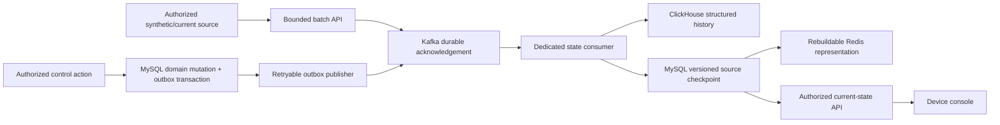
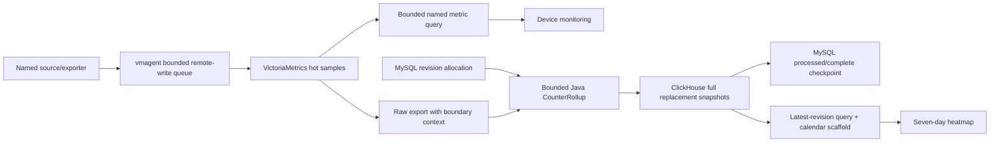

# NOERIVA data flows

These diagrams describe the code currently present. Dashed future responsibilities below are design requirements and are not implementation claims.

## Current-state/control lane

The original source time, epoch and sequence remain separate from central acceptance. Replay cannot refresh an old observation or replace a newer source state. Host, BMC and network sources retain separate freshness. The consumer's ClickHouse acknowledgement and MySQL checkpoint are not a distributed transaction; stable identities and idempotent replacement/read semantics handle retries. No raw evidence archival is implied.

## Numerical metrics and maintained bandwidth summaries

The verified local end-to-end test imports synthetic raw counters into the actual VictoriaMetrics engine, exports their original sample values/timestamps, runs the worker, inserts a synchronous ClickHouse snapshot and queries that snapshot. Source/exporter adapters on real devices are not verified by this test. Native Prometheus metric floating-point storage is not a byte-exact archive of every UInt64 input.

Recompute accepts one explicit source/interface/direction and at most one day of closed UTC-five-minute-aligned data, with a 90-second context on each boundary. Empty or unbracketed raw visibility cannot overwrite existing history as missing. Proven counter reset, restart and gap intervals do not add invented deltas. Corrected buckets replace old revisions; source timestamps are independent of generation time. Partial replay must invalidate overlapping older completeness in the durable state store.

The heatmap reads maintained five-minute summaries. It creates 168 display positions from seven local calendar dates, using actual UTC intervals for DST/offset alignment. Current cells remain provisional; missing/future values are null and observed zero remains zero. Storage timeouts, bounded scans and explicit ClickHouse query cancellation apply before a response reaches the browser.

## Demo profile

The explicit `demo` profile substitutes deterministic source repositories and marks returned numerical data `SIMULATED`. The console still exercises the same HTTP/query contracts. The production profile never silently changes to demo data after a provider failure.

## Future complete event/evidence lane

V5 requires actual Edge local durable spool and mTLS batches, compact Protobuf transport for high-volume events, bounded Kafka Streams lifecycle normalization, verified canonical ClickHouse sink behavior, selective redacted Elasticsearch indexing, S3 raw-batch archival/manifest reconciliation and scoped notifications. These additions must preserve separate `RECEIVED`, `DURABLY_QUEUED`, `QUERYABLE` and `EVIDENCE_ARCHIVED` states.

NAT/IP investigation additionally requires candidate publication generations, latest canonical interval verification and historical VPN/DHCP/AAA correlation with ambiguity/gap metadata. Configuration/evidence flows require approved source adapters, immutable evidence IDs, checksum verification and provider-specific retention-lock testing. They remain designed in the master and capability matrices; the current console does not fabricate their results.
