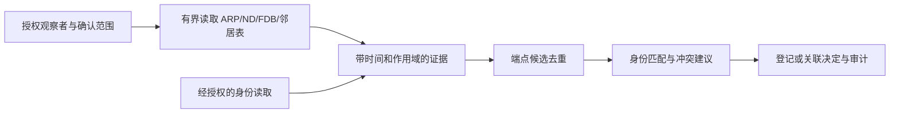

# 网络发现与保守去重研究

研究日期：2026-09-07。本文依据官方标准、厂商发布的 MIB/Redfish schema 和仓库代码提出设计；研究阶段没有修改应用代码，本作者没有访问真实设备地址或执行扫描。研究后另行获准实现的数据库候选工作流见第7节和 [当前 API](NETWORK-DISCOVERY-API.md)。本次六台已提供设备的真机读取由主任务另行执行。用户提到的 `168.4.*` 不是完整 CIDR；在确认准确地址范围、前缀长度与所属站点/路由域前，不补写成某个私网，也不扩大为整段扫描授权。

## 1. 可以采用的发现方式

优先读取已有授权网关/交换机的邻居表，生成带来源和时间的候选，再对选定候选执行经授权的身份验证。它减少逐地址尝试，但不能保证找出全部设备：静默设备、过期条目、未开启 LLDP/CDP、不同 VRF 和权限视图都会留下缺口。读取网关的 SNMP 表本身仍是主动管理请求，不能称为零网络交互的被动发现。

| 方法 | 得到的证据 | 能解决的问题 | 必须保留的限制 |
|---|---|---|---|
| 网关 IPv4 ARP / IPv6 ND 表 | 某观察者接口上的 IP↔链路地址映射、状态、更新时间线索 | 找到近期与网关通信的候选地址 | 不是所有配置/在线设备；跨路由只看到下一跳，proxy ARP/ND 可能代理多个地址 |
| 交换机 MAC/FDB 表 | VLAN/FDB、MAC、桥端口及学习状态 | 把已知 MAC 关联到转发方向，辅助定位接入路径 | 不是 IP 清单；上联口、LAG、虚拟交换机可对应许多设备；条目老化不等于资产消失 |
| LLDP | 本地端口、远端 chassis/port 标识及 subtype、可选管理地址/系统描述 | 获得直接邻接与管理地址候选 | 只描述已接收通告；标识可能是本地字符串，不保证全局唯一或可登录 |
| Cisco CDP | 邻居设备 ID、端口、平台、地址 TLV、管理地址 TLV | 补充 Cisco 邻接与候选地址 | 厂商协议；Device-ID 可以为空或为配置名称；没有通告不等于没有设备 |
| 已授权 SNMP 身份读取 | sysObjectID、sysName/sysDescr、实体 serial/model、USM engine/context | 区分厂商候选与组件身份，关联管理端点 | sysObjectID 表示产品/管理子系统类型；名称可修改；一个管理器可能暴露多个实体 |
| 已授权 Redfish 身份读取 | service / Manager / ComputerSystem UUID、各自序列号及明确 Links | 区分 BMC 管理器和受管主机，建立管理关系 | 不同资源的 UUID/serial 不是同一种身份；多 Systems、多个 Manager 不可压成一台设备 |

ARP/ND 映射与状态依据 [RFC 4293 IP-MIB](https://www.rfc-editor.org/rfc/rfc4293.html)，邻居缓存和 STALE 含义依据 [RFC 4861](https://www.rfc-editor.org/rfc/rfc4861.html)。FDB 转发语义依据 [RFC 4188 BRIDGE-MIB](https://www.rfc-editor.org/rfc/rfc4188.html) 与 [RFC 4363 Q-BRIDGE-MIB](https://www.rfc-editor.org/rfc/rfc4363.html)。LLDP 依据 [Cisco 官方发布的 IEEE LLDP-MIB](https://raw.githubusercontent.com/cisco/cisco-mibs/main/v2/LLDP-MIB.my)，CDP 依据 [Cisco 官方 CISCO-CDP-MIB](https://raw.githubusercontent.com/cisco/cisco-mibs/main/v2/CISCO-CDP-MIB.my)。这些文档说明对象语义，不表示本次 Cisco/Dell 固件已经开放全部对象；实际可见性须按该固件和账号验证。

DHCP 租约、DNS/IPAM/CMDB 可作为后续补充来源；它们也不能把租约或名称直接证明为永久资产身份。当前最小实现不需要广播发现、开启设备端协议、清除 ARP/FDB、发送流量来填表，或遍历所有候选凭据。

## 2. 可落地的只读对象与解析要求

### 网关 ARP / IPv6 ND

优先 `ipNetToPhysicalTable = 1.3.6.1.2.1.4.35`，entry 为 `.1`。索引是 **ifIndex + InetAddressType + InetAddress**，不是一个整数。读取 `.4` PhysAddress、`.5` LastUpdated、`.6` Type、`.7` State；地址和地址族来自已正确解析的复合索引。IPv4、IPv6 和带 zone 的地址必须按长度/类型验证，不能把后四段 OID 一律当 IPv4。

`LastUpdated` 是观察者当时的 sysUpTime ticks，不是 Unix 时间；同时保存本轮 receivedAt、观察者 uptime/engine epoch。重启或值为零时不推导绝对发生时间。IPv4 在未使用 Neighbor Unreachability Detection 时可以正常返回 `unknown(6)`，不能因 unknown 丢弃所有 IPv4 ARP；`invalid`/`incomplete` 不形成已验证的 MAC 映射。IPv6 的 STALE 表示近期可达性未获确认，不等于 OFFLINE。[RFC 4293](https://www.rfc-editor.org/rfc/rfc4293.html)、[RFC 4861](https://www.rfc-editor.org/rfc/rfc4861.html)

旧 IPv4 `ipNetToMediaTable = 1.3.6.1.2.1.4.22` 可作为明确标识的兼容来源，记录其较少的状态/时间证据；不能把未返回的更新时刻补成采集时刻。现代、旧表同一观察者/接口/地址/时间窗口出现相同事实可合并展示，仍保留两个来源引用。

每条映射的作用域至少是 `organization + discoveryScope/routingDomain + observer + context + localIfIndex`。site 并不等于 VRF。跨 VRF 的相同 IP/MAC 不合并；IPv6 link-local 的 zone 属于观察者接口，不能照抄为采集器本机接口。当前 TargetPolicy 拒绝 link-local，最小发现实现只保存此类证据，不能绕过策略直接连接。

### 交换机 MAC/FDB

| 对象 | OID | 关键联接 |
|---|---|---|
| dot1dTpFdbTable | `1.3.6.1.2.1.17.4.3` | entry `.1`：MAC `.1`、bridge port `.2`、status `.3` |
| dot1dBasePortIfIndex | `1.3.6.1.2.1.17.1.4.1.2` | 将 bridge port 转换为 IF-MIB ifIndex |
| dot1qTpFdbTable | `1.3.6.1.2.1.17.7.1.2.2` | 索引 `FDB ID + MAC`；entry `.1` 的 port `.2`、status `.3` |
| dot1qVlanFdbId | `1.3.6.1.2.1.17.7.1.4.2.1.3` | VLAN 当前表索引含 TimeMark/VLAN；映射 VLAN→FDB ID |

FDB ID 不能直接当 VLAN ID；bridge port 不能直接当 ifIndex。端口值为 0 表示该表没有学得端口，不能创建“0号接入口”。一个 FDB 可服务多个 VLAN；只在路由域、VLAN/桥域映射和时间证据一致时，才把网关 IP↔MAC 与交换机 MAC↔端口联接。学习表可以把 MAC 指向上联/LAG，仅形成“经此端口可见”的边，不强称“终端直接插在此口”。这些索引与语义来自 [BRIDGE-MIB](https://www.rfc-editor.org/rfc/rfc4188.html) 和 [Q-BRIDGE-MIB](https://www.rfc-editor.org/rfc/rfc4363.html)。

### LLDP / CDP

LLDP 旧标准表 `lldpRemTable = 1.0.8802.1.1.2.1.4.1`，索引为 `TimeMark + LocalPortNum + RemIndex`；chassis subtype/id 为 entry `.4/.5`，port subtype/id 为 `.6/.7`，sysName/sysDescr 为 `.9/.10`。管理地址另在 `lldpRemManAddrTable = ...1.4.2`，索引还包含地址族和地址。LocalPortNum 按本地 LLDP 端口表的标识类型映射，不能未经验证直接等同 ifIndex。chassis/port 必须保存 subtype + 原始字节；`local` 字符串、interfaceName、MAC 等类型具有不同的身份范围。[LLDP-MIB](https://raw.githubusercontent.com/cisco/cisco-mibs/main/v2/LLDP-MIB.my)

CDP `cdpCacheTable = 1.3.6.1.4.1.9.9.23.1.2.1`，索引为 `ifIndex + DeviceIndex`。entry 的 AddressType/Address 为 `.3/.4`，DeviceId `.6`、DevicePort `.7`、Platform `.8`；PrimaryMgmtAddrType/Addr 为 `.19/.20`。优先把管理地址 TLV 作为候选，缺失时把普通 Address TLV 标为较弱线索；忽略不可用的 `0.0.0.0`，不把设备名称自动交给 DNS 扩大目标。完整地址 TLV 需按 `cdpCtAddressTable` 另行解析。[CISCO-CDP-MIB](https://raw.githubusercontent.com/cisco/cisco-mibs/main/v2/CISCO-CDP-MIB.my)

LLDP/CDP 通告内容属于设备提供的线索；即使读取观察者使用认证 SNMP，也不能把远端通告本身提升为端到端密码学身份。候选地址须重新通过已确认范围、TargetPolicy 和凭据授权检查；递归扩展默认关闭。

## 3. 身份与去重规则

### 身份主张须区分主体

| 身份主张 | 主体/范围 | 去重处理 |
|---|---|---|
| ComputerSystem.UUID | 受管系统 | UUID 格式有效、主体类型一致且无冲突时，作为强关联线索 |
| Manager.UUID / Manager.SerialNumber | 管理器/BMC | 与系统 UUID/serial 分开；不能因同样字符串跨主体合并 |
| ServiceRoot.UUID | Redfish 服务实例 | 关联服务端点，不作为物理机 UUID |
| ENTITY chassis serial | 该机箱实体及厂商命名空间 | 需验证实体 class、厂商/型号和有效值；板卡、PSU serial 不能代替 chassis serial |
| SNMP engineID | 一个行政域中的 SNMP engine | 关联 engine/context，不能作为全局资产唯一键 |
| sysObjectID | 产品/管理子系统类型 | 用于 profile 候选，不用于唯一资产匹配 |
| sysName、sysDescr、DNS 名称 | 可修改描述 | 弱线索，不能单独自动合并 |
| MAC | 某接口/虚拟接口在具体链路域上的地址 | 可能多接口、多地址、随机化、克隆或代理；不作资产主键 |
| IP 地址 | 特定站点/路由域/时间的端点地址 | 可迁移、复用、多地址、NAT；仅用于当前端点去重 |
| SSH host key / TLS 证书指纹 | 当前端点提供的信任材料 | 可显示复用/变化证据，不设为唯一资产约束，也不据此自动合并 |

Redfish 三种 UUID 的主体分别见 [ComputerSystem v1.28.0](https://redfish.dmtf.org/schemas/v1/ComputerSystem.v1_28_0.json)、[Manager v1.25.0](https://redfish.dmtf.org/schemas/v1/Manager.v1_25_0.json)、[ServiceRoot v1.21.0](https://redfish.dmtf.org/schemas/v1/ServiceRoot.v1_21_0.json)。版本仅固定本次研究依据；客户端仍按设备实际返回 schema 读取可用字段，不要求旧固件实现最新版本。UUID 按不透明规范字符串处理，不能自行交换 SMBIOS 字节序或解析其中子字段。

`ComputerSystem.Links.ManagedBy` 与 `Manager.Links.ManagerForServers` 能表示明确管理关系。一个 BMC 可以管理多个系统；BMC 地址和主机业务地址不同，并不说明存在两台物理服务器。当前资产可继续把 HOST 作为逻辑设备并挂其管理端点；若已分别登记 HOST/BMC，则保留两个资源并建 `MANAGES` 关系。**建立管理关系不等于合并两个资产**，也不自动搬迁其监控历史。关系应有具体 Redfish 资源路径和观察时间作证据。[ComputerSystem schema](https://redfish.dmtf.org/schemas/v1/ComputerSystem.v1_28_0.json)、[Manager schema](https://redfish.dmtf.org/schemas/v1/Manager.v1_25_0.json)

RFC 3411 只要求 engineID 在行政域内唯一，并明确不同行政域可能相同；Cisco 官方也说明重复 engineID 会发生冲突。因此配置复制/克隆导致重复应作为冲突情况处理，不能因为“标准要求唯一”就覆盖另一台资产。USM engineID 还参与密钥本地化，其变化是重新验证/断代的信号，不证明新物理机或旧机消失。[RFC 3411 §3.1.1.1](https://www.rfc-editor.org/rfc/rfc3411.html)、[Cisco SNMP 排障](https://www.cisco.com/c/en/us/support/docs/security/secure-web-appliance-virtual/220561-configure-and-troubleshoot-snmp-in-swa.html)

ENTITY 序列号允许空值，部分实现甚至允许写入，因此序列号是有来源的主张，不是不可伪造证明。[RFC 6933 ENTITY-MIB](https://www.rfc-editor.org/rfc/rfc6933.html) 零 UUID、全 F UUID 均为特殊值，不可用作唯一设备键；空白、`unknown`、`default`、`to be filled by OEM` 等作为建议的可配置占位值规则，后者是产品清洗策略，**并非标准规定所有厂商都会使用这些词**。[RFC 9562 Nil/Max UUID](https://www.rfc-editor.org/rfc/rfc9562.html)

**本次会话的独立观察**：主任务报告三个不同 iMana 管理地址使用相同 RSA SSH host key，其中两个也共用 ECDSA key。本调研未连接或复测这些目标，也不推断复用原因；它足以说明本轮不能把 SSH key 相等用作自动合并条件。精确指纹和读取证据由真机验收报告保存，此处不复制密钥、凭据或假称为厂商标准。TLS 证书同样可能复用或正常续期，去重与连接信任策略应分开。

### 建议的确定性决策

1. **候选记录去重**：相同 organization、discovery scope/routing domain、规范化地址/zone、协议、端口、SNMP context，可合并为一个当前端点候选，并追加各观察者证据。这是去除重复列表项，不是合并资产。纯 MAC/FDB 行没有 IP 时保留链路候选，不制造可登录地址。
2. **既有端点**：端点已被人工绑定，身份仍一致时返回 `EXISTING_ENDPOINT`，后续发现幂等更新 lastSeen/evidence。相同地址出现新的冲突身份，返回 `CONFLICT`，不重用旧资产的凭据和历史。
3. **新地址、相同强身份**：同主体类型、同厂商/命名空间、有效 UUID 或 chassis serial 与既有资产相符，且没有同时在多个不相容位置出现，返回 `MATCH_REVIEW`。默认建议挂新端点或确认地址迁移，先保留旧端点及有效时间，不能改写历史上的 IP。
4. **管理关系**：Manager 与 ComputerSystem 有明确 Links 时返回 `LINK_ONLY/MANAGES`。相同 serial 但主体不同、堆叠、多机箱、多系统或管理器更换，均不得直接自动合并。
5. **弱证据或冲突**：只有 MAC、名称、产品 OID、engineID、SSH key 或 TLS 指纹时为 `UNRESOLVED`；UUID/serial 重复但其他强证据冲突时为 `CONFLICT`。不做无依据的“95% 同一台”概率评分。
6. **资产修改**：最小版本只有“登记新资产 / 关联既有资产 / 建立管理关系 / 忽略候选”四种明确决定，并以 revision、幂等键和审计控制。不提供后台自动破坏性合并。后续若实现资产合并，要另做引用迁移、历史保留、冲突预览和回退契约。

## 4. 当前仓库可复用的部分与缺口

本节来自本地代码读取，不是已经实现新发现接口的声明。

| 现有结构 | 可复用 | 本次发现/去重仍缺少 |
|---|---|---|
| `Models.Device` / `MySqlRepository.create` / V1、V5 migration | 组织/站点、随机设备 UUID、管理地址查询索引、审计 | 管理地址索引非唯一；每次 create 都分配 UUID，没有跨端点身份主张和登记幂等去重 |
| `device_connection` / `DeviceAccessStore` | 每资产 SNMP/Redfish 两个 slot、独立加密配置、CAS、90 秒租约、发布来源 | 没有“尚未登记资产”的候选/端点模型；slot 只代表协议来源，不能推导设备是 HOST 还是 BMC |
| `DeviceProtocol.Identity` / `Reading.facts` | 厂商候选、serial/model、原始 sourceRef 和安全 facts | Identity 没有分别保存 System/Manager/Service UUID；Redfish 目前优先用 System serial，缺失时用 Manager serial，不能直接拿这个聚合字段去重 |
| `SnmpDriver` / `SnmpSession` | SNMP v2c/v3、固定地址、隔离 USM、25 秒及变量/接口预算 | 没有 ARP/ND/FDB/LLDP/CDP 读取；现有 `walk` 只接受单整数实例，复合索引会被拒绝，必须新增类型化 decoder |
| `TargetPolicy` / 凭据库 | 每次重新校验 DNS 全部结果、允许网段、禁止危险目标、密文 AAD scope | 默认私网 CIDR 是出站约束，不等于本次发现授权；需要任务自己的精确范围、观察者列表与凭据授权 |
| `network_interface.source_id` / `portId` | source 精确路由；设备/slot/key 范围内的稳定接口 ID | 接口稳定不等于资产去重；MAC 变化、同名接口或同 MAC 的虚拟设备需独立冲突规则 |
| `topology_edge` 与工作台证据 | 可显示已有拓扑、保存带摘要证据与审计 | 没有带观察者/时间/VRF 的邻居采集、证据过期、管理关系与身份合并服务 |

相关代码：[DeviceProtocol](../../services/noeriva-control/src/main/java/io/noeriva/control/devices/DeviceProtocol.java)、[DeviceAccessStore](../../services/noeriva-control/src/main/java/io/noeriva/control/devices/DeviceAccessStore.java)、[RedfishDriver](../../services/noeriva-control/src/main/java/io/noeriva/control/devices/RedfishDriver.java)、[SnmpSession](../../services/noeriva-control/src/main/java/io/noeriva/control/devices/SnmpSession.java)、[MySqlRepository](../../services/noeriva-control/src/main/java/io/noeriva/control/MySqlRepository.java)、[TargetPolicy](../../services/noeriva-control/src/main/java/io/noeriva/control/devices/TargetPolicy.java)。

## 5. 扩展方案（后续参考，非当前 API）

第一阶段采用 **已登记观察者 → 邻居表候选 → 去重建议 → 明确登记/关联**。不接触候选设备、不递归扩张、不自动启用采集；已有六台设备可先作为库存基准，只有具备授权和可读表的网关/交换机才能成为观察者。主任务已报告 Cisco ASR1002-X / IOS XE 17.09.08 与 Dell S6100-ON / OS9 9.14(2.23) 身份，这不证明相应 ARP/FDB/LLDP 表都已验证；采集结果须另记。

建议新增 `DiscoveryService`、独立 `SnmpDiscoveryReader`、纯函数复合索引解析器和 `IdentityMatcher`。通用遥测采集不额外全表 WALK；发现是独立租约任务。现有 Worker 可以承担有界执行，但调度队列、状态和预算独立，不能饿死正常周期采集。

最小数据结构：

- `discovery_job`：organization、site、scopeId、确认 CIDR/路由域、观察者连接与 revision、模式/对象族、预算、状态、watermark、counts、错误/partial flags、创建人和时间。凭据只保存受控引用，任务不能接受任意 OID/命令。
- `discovery_candidate`：job、稳定候选 ID、endpointKey、规范化地址/协议/端口/context/zone、角色候选、firstSeen/lastSeen、matchStatus、建议 asset ID、reason codes、revision。按 `(org,job,endpointKey)` 幂等，不按 IP 全局唯一。
- `discovery_evidence`：candidate、observer、scope/context/interface、方法、MIB OID 或 Redfish path、typed value、主体角色、observedAt/receivedAt、agent ticks/epoch、原始行摘要、quality。可引用现有不可覆盖证据内容，热点列表只保存投影与引用，不每页解码大快照。
- `device_endpoint` 与 `device_identity_claim`：端点→资产的时间化绑定；身份的 kind/namespace/subject、值和 hash、来源、first/lastSeen、确认/冲突状态。身份值使用**非唯一查询索引**以记录克隆冲突；唯一本体主键仍是组织内资产 UUID。主体关系保存 `MANAGES` 证据，不能只靠一个 serial 列表达。

身份查询按 `(org,kind,namespace,valueHash)` 定位，候选按 `(org,job,status,id)` keyset 分页，端点按 `(org,scope,endpointKey)` 查找。登记/关联决定在组织作用域事务内检查 revision 和幂等键，重复点击返回同一结果；不能“先查询无记录、再无约束插入”造成并发重复。

### 建议 API（全部尚未实现）

| 接口 | 行为与边界 |
|---|---|
| `POST /api/v1/discovery-jobs` | ADMIN；body 为 siteId、scopeId、已确认 CIDR、`seedConnections[{deviceId,slot,revision}]`、methods、`mode=OBSERVER_TABLES`、idempotencyKey；202 返回 jobId/revision。服务器验证组织、观察者、范围和允许对象族 |
| `GET /api/v1/discovery-jobs/{id}` | 返回状态、预算、按观察者的完成/partial 标志和计数。completed 表示任务完成，不能解释为网段已穷尽 |
| `GET /api/v1/discovery-jobs/{id}/candidates?cursor=&limit=50&status=` | 最大100；只返回小型身份/端点/冲突投影；包含 evidenceCount 和引用 |
| `GET /api/v1/discovery-jobs/{id}/candidates/{candidateId}` | 有界证据摘要、来源和建议；大原始数据通过受控证据入口取回 |
| `POST /api/v1/discovery-jobs/{id}/decisions` | ADMIN；每次最多50个 `{candidateId,revision,action,targetDeviceId?}`；action 为 REGISTER/LINK_ENDPOINT/LINK_MANAGES/IGNORE；事务、幂等、审计，不自动覆盖已有连接目标或搬迁历史 |

第二阶段才增加候选身份验证任务：显式选中候选、显式赋予该候选的凭据使用权，再调用只读身份探测。当前密文绑定 `org/device/slot`，不能复制密文到新候选/新资产；候选凭据须有独立 AAD scope、加密保存和删除策略，晋升为资产连接时重新加密、默认停用。候选表里的邻居地址不能自动获得某网关的 SNMP community 或 BMC 密码。请求处理器必须在发送前重新核对范围，发现结果不扩张授权。

### 建议预算与状态

以下是实现起点，不是压测结论：每任务最多8个观察者、每观察者25秒/2500返回变量、每任务20000变量/2000候选/120秒，最多2个观察者并发；每表最多500行，达到任何上限标 `PARTIAL_LIMIT` 并记录未完成对象族。单个目标仅一个在途 PDU，按 OID 递增/子树检查，首轮不重试；不把轮询得到的整个 FDB 展开成无界目标队列。

支持 `QUEUED/RUNNING/COMPLETED/PARTIAL/FAILED/CANCELLED`；租约到期允许有限重试，证据和候选按 job/observer/rowKey 幂等。缺表用 `NOT_OBSERVED_OR_NOT_VISIBLE`，授权失败、timeout、坏索引和预算截断分别记录；空结果不宣称零设备。表更新时间不完整时 only observedAt，过期证据不生成离线/删除结论。

## 6. 需要的测试与验收

| 测试场景 | 必须证明 |
|---|---|
| 真实 UDP SNMP fixture 返回 ARP/IPv6 复合索引、稀疏表、非法长度 | 地址族/长度/zone正确；按完整索引关联，不能 zip 不同设备 |
| IPv4 State=unknown、IPv6 STALE/INCOMPLETE、LastUpdated=0/uptime重置 | 正常 ARP 不被全丢；旧/不完整状态不变成在线/离线证明；不制造绝对更新时间 |
| Q-BRIDGE FDB ID≠VLAN，bridge port≠ifIndex，port=0 | 正确联接或明确未解析，不画虚假物理直连 |
| 同 MAC 在不同 VLAN/VRF、多个下游 MAC 经同上联/LAG | 保留作用域/转发关系，不合并终端 |
| LLDP subtype=MAC/local/interfaceName，多个管理地址、重复 RemoteIndex | subtype和索引完整；远端ID重复不造成冲突覆盖 |
| CDP缺DeviceId/管理TLV、0.0.0.0地址、表老化 | 保留弱证据，不构造探测目标，不删除资产 |
| 同端点重复被多个观察者发现、并发提交相同决定 | 候选/决定幂等，证据可追加，最多创建一个资产 |
| IP迁移后UUID一致、旧IP分配给新机器 | 提示新增端点/迁移；地址历史不重写；新身份不继承旧凭据和曲线 |
| 克隆engineID、相同sysName/sysObjectID、重复/占位serial | 标冲突或未知，不自动合并 |
| 相同SSH host key或TLS证书的不同目标、正常证书续期 | 不以key/证书作唯一资产约束；连接信任变更与资产身份判断分离 |
| Redfish同服务多System、System和Manager相同serial、UUID为空/Nil/Max | 保留各主体，建立有来源MANAGES关系，不以第一台System代表全服务 |
| 历史已有HOST和BMC分别登记，同一physical chassis线索 | 输出关联建议，不能自动合并库存/历史/两个协议连接 |
| 候选地址指向范围外、metadata/link-local、跨组织连接引用、DNS变化 | 读取前拒绝，且拒绝后无网络请求；不会复制或尝试其他凭据 |
| 2500变量、500行、2000候选、超时/取消、乱序OID、坏BER | 消耗始终有界、部分状态真实、套接字与租约释放 |
| MySQL两个组织同地址/同serial、revision竞争、失败回滚 | 组织隔离、冲突可表达、没有半登记和重复审计提交 |
| 浏览器列表/证据/确认操作 | 清楚区分“发现候选”“已登记”“管理关系”“冲突”；普通读角色无法看到凭据 |

协议 fixture 先验证解析和状态机，数据库集成验证隔离/并发，之后才在**已确认范围和既有授权**内逐一验证网关/交换机对象、端点身份和去重建议。真实采样需记录型号、固件、对象可见性、观察者路由域、时间与摘要；不能用本次研究或单个 CLI 输出宣称自动发现已部署。

## 7. 本次结论的边界

本研究后的实现采用更小的数据库工作流：新增 [发现候选 API](NETWORK-DISCOVERY-API.md)，从已经保存且不足15分钟的 SSH 邻居证据生成候选，支持同站点同IP候选幂等、弱重复提示、冲突保留、显式登记与关联。它不扫描、不读取新的邻居表、不探测候选、不合并资产历史。上述 `discovery-jobs`、SNMP 复合索引邻居表、IPv6 ND/FDB 与 `MANAGES` 等设计仍是后续建议，**不是本轮已实现接口**。

实际入口是 `/api/v1/discovery/runs` 和 `/api/v1/discovery/candidates`，ADMIN/OPERATOR 可以写，VIEWER 可以读取安全投影；具体字段与权限以独立 API 契约为准。实际预算为最多8个来源、每来源256条保存观察、每候选16条证据，每实例4个在途请求、10秒数据库总预算。最新证据窗口会优先保留冲突代表，避免截断后错误放行登记。发现入口内部登记幂等且并发安全；旧人工登记仍允许重复地址，发现遇到已有多条同址资产时展示 CONFLICT，不能宣称平台管理地址全局唯一。

本轮数据库测试使用独立 MySQL 容器和合成邻居证据；真机与浏览器集成验收由单独报告记录。本研究没有据 `168.4.*` 猜测任何目标，更没有访问新增地址。后续主动读取或探测仍须先确认准确网段/路由域与授权观察者信息。

Manager 最新 JSON 的浏览工具渲染返回异常，但本轮已直接从同一 DMTF 官方 HTTPS URL 成功读取并核对 UUID、SerialNumber、ManagerForServers 定义；没有用第三方解释替代。其余引用为 RFC Editor、DMTF 与 Cisco 官方仓库/文档，源码链接对应当前本地实现，方案与事实已分开标注。
